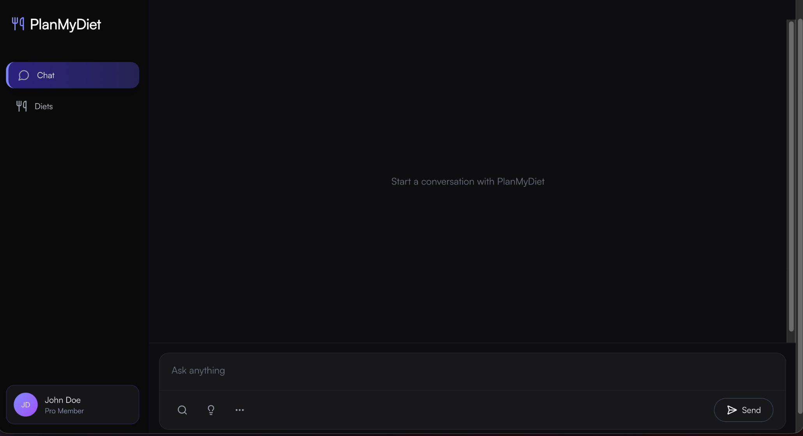
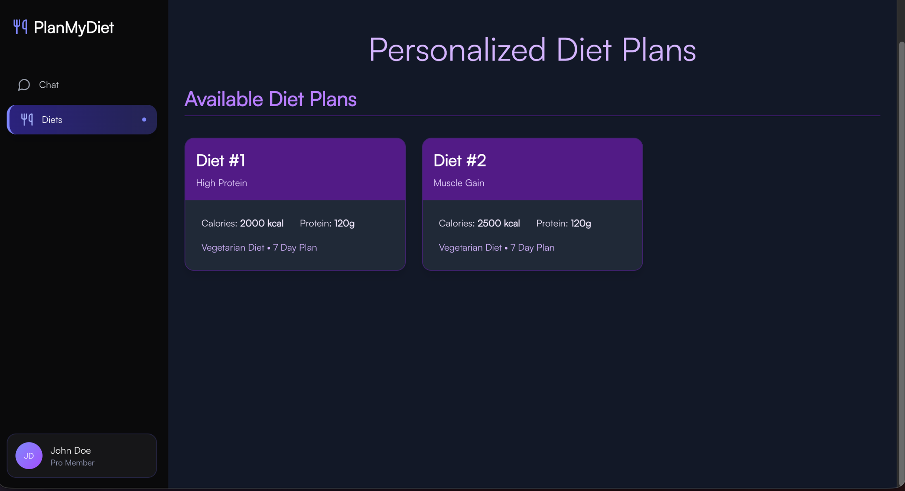
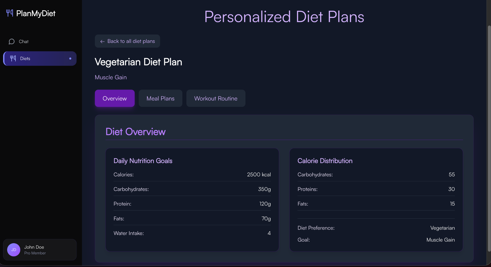
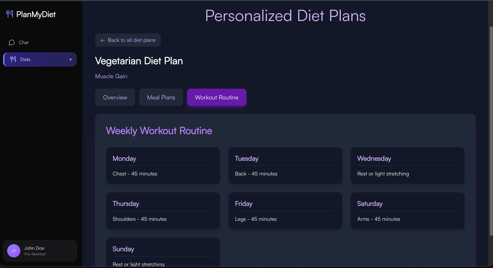

# Plan My Diet

<div align="center">

AI-powered diet planning and meal logging with a FastAPI backend and Next.js frontend.


[](https://bda-project-henna.vercel.app/chat)


</div>

## Table of Contents

- [About](#about)
- [Features](#features)
- [Tech Stack](#tech-stack)
- [Preview](#preview)
- [Getting Started](#getting-started)
- [Environment Variables](#environment-variables)
- [Activity](#activity)
- [Contributors](#contributors)
- [Support](#support)

## About

PlanMyDiet is a health assistant application that helps users:

- Generate personalized diet plans.
- Log meals in natural language.
- Retrieve stored diet plans.
- Chat with an AI nutrition assistant.

The backend uses FastAPI and SQLite, while the frontend is built with Next.js and TypeScript.

## Features

- Unified AI endpoint for conversation, diet planning, and meal logging.
- Structured JSON responses from Groq LLM integration.
- SQLite persistence for users, diet plans, and meal logs.
- Modern frontend UI for chat and diet plan visualization.
- CORS-enabled API for local frontend-backend integration.

## Tech Stack

- Backend: FastAPI, Pydantic, Uvicorn, Requests, Python Dotenv
- Frontend: Next.js 16, React 19, TypeScript, Tailwind CSS
- Database: SQLite
- AI Provider: Groq Chat Completions API

## Preview

<div align="center">










</div>

## Getting Started

### Prerequisites

- Python 3.12
- Node.js 18+
- pnpm

### 1. Backend Setup

```bash
cd backend
python -m venv .venv
source .venv/bin/activate
pip install -r requirements.txt
python db.py
uvicorn main:app --reload --port 8000
```

Backend runs at http://localhost:8000

### 2. Frontend Setup

```bash
cd frontend
pnpm install
pnpm dev
```

Frontend runs at http://localhost:3000

## Environment Variables

Create a `.env` file in the project root (or in backend if preferred by your runtime) with:

```env
GROQ_API_KEY=your_groq_api_key
NEXT_PUBLIC_API_URL=http://localhost:8000
```

## Activity


## Contributors

<a href="https://github.com/ronakrpanchal/BDA-Project/graphs/contributors">
  
</a>

## Support
if you find the project useful, please consider giving it a star ⭐ 💫

Thank you 🤩